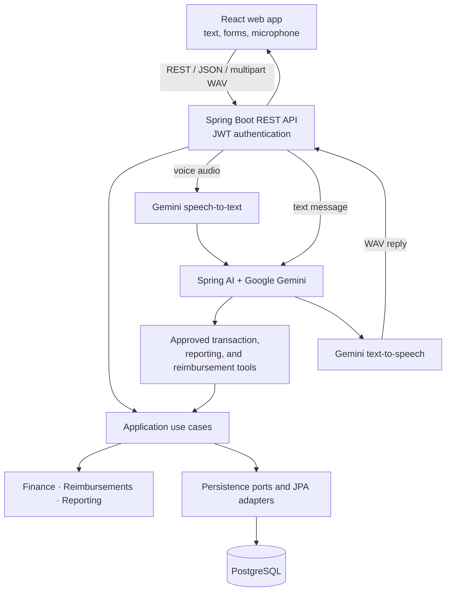

# TalkTally

English | [Português](README.pt-BR.md)

**A bilingual, voice-first personal finance assistant for recording and understanding everyday money activity.**

[](https://github.com/souzacef/talktally/actions/workflows/backend-ci.yml)
[](https://github.com/souzacef/talktally/actions/workflows/frontend-ci.yml)

[**Open the live demo**](https://talktally.onrender.com)

TalkTally combines deterministic financial workflows with a constrained AI assistant. Users can manage income, expenses, installments, and reimbursements through a responsive web interface or natural-language text and voice commands. The UI supports English and Brazilian Portuguese.

## Live demo

Visit [talktally.onrender.com](https://talktally.onrender.com). After a period of inactivity, the application may take a couple of minutes to become ready. AI features depend on Google Gemini API availability and quota.

## Highlights

- Create, edit, inspect, filter, and paginate ordinary income and expense transactions.
- Schedule monthly installments independently from the economic event date, including anchored month-end rollover and exact-cent allocation.
- Use a stable category catalog with friendly labels and kind-aware transaction forms.
- Explore dashboard totals, category breakdowns, monthly cash flow, and recent activity.
- Track money owed by people, reimbursable expenses, and partial or complete repayments.
- Ask financial questions or record transactions through the constrained AI assistant.
- Speak commands through browser microphone capture, Gemini speech-to-text, and synthesized voice replies.
- Switch the responsive UI between English and Brazilian Portuguese.
- Keep a bounded, per-user assistant transcript for the current browser session.
- See authoritative transaction occurrence schedules and recorded/updated timestamps.

## Example interactions

```text
I spent R$ 40 on coffee today.
How much did I spend this month?
Ana reimbursed me R$ 25 today.
Gastei R$ 23 em alimentação hoje.
Quanto eu recebi de reembolsos este mês?
```

The assistant asks for clarification instead of writing data when required details are missing or a reimbursement target is ambiguous.

## Architecture

TalkTally is a modular monolith. Domain and application rules remain deterministic; infrastructure adapters connect them to HTTP, persistence, security, and AI providers.



The model has no direct database access. It can call only registered application tools; authenticated user identity and transaction source are supplied through trusted server context rather than model-controlled arguments.

## Spring AI integration

The backend uses **Spring AI 2.0.0** with Google GenAI. Its default chat and transcription model is `gemini-3.5-flash`, configurable through `GOOGLE_AI_MODEL`. Voice synthesis defaults to `gemini-3.1-flash-tts-preview` with the `Kore` voice, both configurable through environment variables.

The approved tool surface covers:

- recording and searching ordinary transactions;
- deterministic summaries, category breakdowns, and monthly cash flow;
- recording reimbursable expenses and payments;
- listing claims and querying amounts owed by person.

Business validation, monetary calculations, category compatibility, ownership, repayment rules, and persistence remain in the application/domain layers. The assistant response parser is fail-closed: missing, blank, or unrecognized completion markers produce an unavailable response instead of being treated as success.

Normal automated tests use offline substitutes and require no Google API key or network access. Provider-backed text and voice tests are separate, opt-in Gradle tasks.

## Voice pipeline

1. The browser captures microphone input as WAV audio.
2. Speech activity detection stops recording after a bounded silence period.
3. The backend validates the audio and sends it to Gemini for transcription without translating semantic content.
4. The transcript runs through the same assistant use case and approved tools as text input.
5. Gemini synthesizes the final response, with explicit BRL identity and factual-fidelity guidance.
6. The browser attempts playback and always preserves manual audio controls when speech is available.

Text exchanges are retained in bounded `sessionStorage`, scoped to the authenticated user. Audio itself is not added to that transcript.

## Tech stack

| Area | Technologies |
| --- | --- |
| Backend | Java 25, Spring Boot 4.1.0, Spring AI 2.0.0, Spring MVC, Spring Security/JWT, Spring Data JPA/Hibernate, Flyway, Caffeine, Gradle |
| Frontend | React 19, TypeScript 6, Vite 8, Tailwind CSS 4, TanStack Query, React Router, Recharts |
| Data and testing | PostgreSQL, H2 for default backend tests, Testcontainers, JUnit, Vitest, Testing Library |
| Delivery | Docker, GitHub Actions, Render, Neon PostgreSQL |

## Security and robustness

- Stateless, signed JWT access tokens protect all application APIs except registration, login, and health checks.
- Passwords use Spring Security's delegating password encoder; raw passwords are not stored.
- Authenticated identity is resolved server-side, and persistence queries are owner-scoped.
- CORS accepts configured exact origins rather than a wildcard policy.
- Fixed-window limits protect registration, login, text-assistant, and voice-assistant requests.
- Request, domain, category, amount, date, pagination, audio, and response-envelope validation fail closed.
- Reimbursement-linked source transactions are protected from unsafe mutation.
- Claim-scoped pessimistic locking serializes concurrent repayments without a global/user-wide lock.
- Secrets are supplied through environment variables; tracked environment examples contain placeholders only.

## Testing

The default suites currently contain **468 tests**:

- **302 backend tests** for domain, application, persistence adapters, HTTP/security behavior, AI tooling, speech, and configuration;
- **166 frontend tests** across 30 files for components, hooks, API integration, navigation, localization, forms, and audio workflows.

Additional opt-in coverage includes a real PostgreSQL/Testcontainers suite, a live Google AI text suite, and a live Google AI voice suite. Ordinary backend and frontend validation does not consume Google quota.

## CI/CD and deployment

GitHub Actions runs the Java 25 backend tests/checks, the PostgreSQL Testcontainers suite, and a production Docker image build. A separate Node 24 workflow runs frontend linting, type checking, tests, and the production build.

The deployed application uses Render for the web frontend and backend API, Neon PostgreSQL for persistent data, and Flyway for versioned schema migration. The production backend runs as a non-root user in a Java 25 multi-stage Docker image.

## Running locally

### Prerequisites

- Java 25
- Node.js 24 and npm
- PostgreSQL
- A Google Gemini API key only when exercising live text or voice AI
- A Docker-compatible runtime only for Testcontainers validation

### Backend

Create the local PostgreSQL database/user expected by your configuration, then prepare a private environment file:

```bash
cp .env.example .env
```

Set `DB_JDBC_URL`, `DB_USERNAME`, `DB_PASSWORD`, and a generated `JWT_SECRET_BASE64` in `.env`. Set `GOOGLE_API_KEY` only if you want live AI features. The remaining supported options and defaults—including model, voice, CORS origin, time zone, port, and token lifetime—are documented in the template.

Load the variables and start the API from the repository root:

```bash
set -a
. ./.env
set +a
cd backend
./gradlew bootRun
```

The API defaults to `http://localhost:8080`; Flyway applies the existing migrations at startup.

### Frontend

In another terminal:

```bash
cd frontend
cp .env.example .env
npm ci
npm run dev
```

`frontend/.env.example` points `VITE_API_BASE_URL` to the local API. Keep both `.env` files private and never commit them.

## Running tests

Backend default validation:

```bash
cd backend
./gradlew test
./gradlew check
```

Opt-in backend suites:

```bash
./gradlew postgresIntegrationTest
./gradlew aiLiveTest
./gradlew aiVoiceLiveTest
```

The PostgreSQL task requires a Docker-compatible runtime. The live AI tasks require an explicitly supplied Google API key and consume provider quota.

Frontend validation:

```bash
cd frontend
npm ci
npm run lint
npm run typecheck
npm run test:run
npm run build
```

## Project structure

```text
talktally/
├── backend/
│   ├── src/main/java/com/talktally/
│   │   ├── domain/          # Financial rules and value objects
│   │   ├── application/     # Use cases and ports
│   │   └── infrastructure/  # Web, security, JPA, AI, and speech adapters
│   ├── src/main/resources/  # Configuration, prompts, and Flyway migrations
│   └── src/test/            # Default and opt-in test source sets
├── frontend/
│   └── src/                 # React app, pages, features, components, and tests
├── .github/workflows/       # Backend and frontend CI
├── Dockerfile               # Production backend image
└── README.md
```

## Current scope

- Financial amounts are BRL-only in the current product scope.
- AI and voice availability depend on Google Gemini API quota and provider availability.
- Assistant conversation history is browser-session scoped, not persisted by the backend.
- TalkTally does not aggregate or import bank accounts; users record activity directly or through the assistant.

## Author

Built by [Carlos Eduardo Freire de Souza](https://github.com/souzacef).
