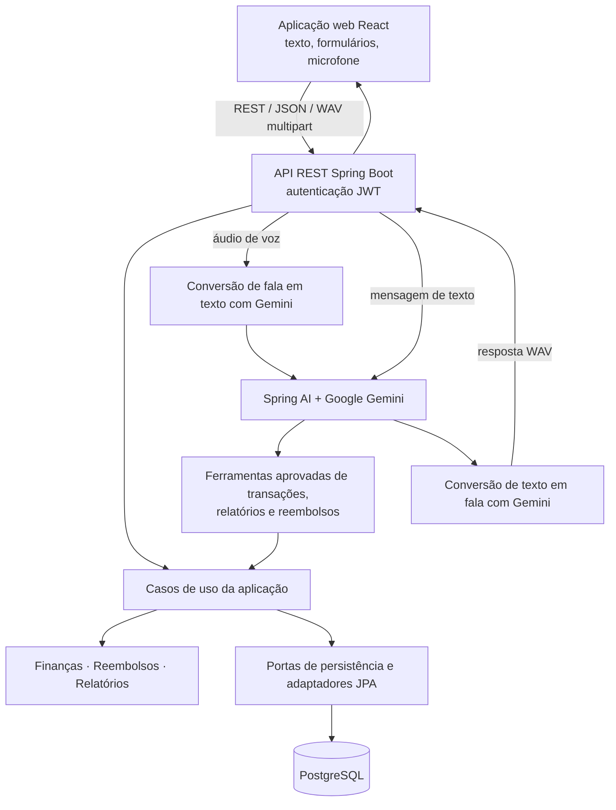

# TalkTally

[English](README.md) | Português

**Um assistente de finanças pessoais bilíngue e orientado por voz para registrar e entender movimentações financeiras do dia a dia.**

[](https://github.com/souzacef/talktally/actions/workflows/backend-ci.yml)
[](https://github.com/souzacef/talktally/actions/workflows/frontend-ci.yml)

[**Abrir a demonstração ao vivo**](https://talktally.onrender.com)

O TalkTally combina fluxos financeiros determinísticos com um assistente de IA restrito. Usuários podem gerenciar receitas, despesas, parcelas e reembolsos por meio de uma interface web responsiva ou de comandos de texto e voz em linguagem natural. A interface está disponível em inglês e português do Brasil.

## Demonstração ao vivo

Acesse [talktally.onrender.com](https://talktally.onrender.com). Após um período de inatividade, a aplicação pode levar alguns minutos para ficar pronta. Os recursos de IA dependem da disponibilidade e da cota da API do Google Gemini.

## Destaques

- Criação, edição, consulta, filtragem e paginação de transações comuns de receita e despesa.
- Agendamento de parcelas mensais independente da data do evento econômico, incluindo avanço de fim de mês ancorado e distribuição exata dos centavos.
- Catálogo estável de categorias, com nomes amigáveis e formulários de transação adequados a cada tipo.
- Dashboard com totais, detalhamento por categoria, fluxo de caixa mensal e atividades recentes.
- Acompanhamento de valores a receber de outras pessoas, despesas reembolsáveis e pagamentos parciais ou integrais.
- Consultas financeiras e registro de transações por meio do assistente de IA restrito.
- Comandos falados por captura do microfone no navegador, conversão de fala em texto pelo Gemini e respostas de voz sintetizadas.
- Interface responsiva disponível em inglês e português do Brasil.
- Histórico limitado do assistente por usuário durante a sessão atual do navegador.
- Cronogramas oficiais das ocorrências das transações e datas de registro/atualização.

## Exemplos de interação

```text
I spent R$ 40 on coffee today.
How much did I spend this month?
Ana reimbursed me R$ 25 today.
Gastei R$ 23 em alimentação hoje.
Quanto eu recebi de reembolsos este mês?
```

O assistente pede esclarecimentos em vez de gravar dados quando faltam informações obrigatórias ou quando o destino de um reembolso é ambíguo.

## Arquitetura

O TalkTally é um monólito modular. As regras de domínio e aplicação permanecem determinísticas; adaptadores de infraestrutura fazem a integração com HTTP, persistência, segurança e provedores de IA.



O modelo não tem acesso direto ao banco de dados. Ele pode chamar apenas ferramentas de aplicação registradas; a identidade do usuário autenticado e a origem da transação são fornecidas por um contexto confiável do servidor, e não por argumentos controlados pelo modelo.

## Integração com Spring AI

O backend utiliza **Spring AI 2.0.0** com Google GenAI. O modelo padrão para chat e transcrição é `gemini-3.5-flash`, configurável por `GOOGLE_AI_MODEL`. A síntese de voz utiliza por padrão `gemini-3.1-flash-tts-preview` com a voz `Kore`; ambos podem ser configurados por variáveis de ambiente.

O conjunto de ferramentas aprovadas contempla:

- registro e busca de transações comuns;
- resumos determinísticos, detalhamentos por categoria e fluxo de caixa mensal;
- registro de despesas reembolsáveis e pagamentos;
- listagem de solicitações e consulta de valores devidos por pessoa.

Validações de negócio, cálculos monetários, compatibilidade de categorias, propriedade dos dados, regras de pagamento e persistência permanecem nas camadas de aplicação/domínio. O parser das respostas do assistente opera de forma fechada em caso de falha (fail-closed): marcadores de conclusão ausentes, vazios ou desconhecidos produzem uma resposta de indisponibilidade em vez de serem tratados como sucesso.

Os testes automatizados comuns usam substitutos offline e não exigem chave da API do Google nem acesso à rede. Os testes de texto e voz com o provedor são tarefas Gradle separadas e opcionais.

## Fluxo de voz

1. O navegador captura a entrada do microfone como áudio WAV.
2. A detecção de atividade de fala encerra a gravação após um período limitado de silêncio.
3. O backend valida o áudio e o envia ao Gemini para transcrição sem traduzir o conteúdo semântico.
4. A transcrição passa pelo mesmo caso de uso do assistente e pelas mesmas ferramentas aprovadas da entrada de texto.
5. O Gemini sintetiza a resposta final com orientações explícitas para preservar a identidade do BRL e a fidelidade dos fatos.
6. O navegador tenta reproduzir o áudio e sempre mantém controles manuais quando a fala está disponível.

As trocas de texto são mantidas de forma limitada no `sessionStorage`, separadas por usuário autenticado. O áudio em si não é adicionado a esse histórico.

## Tecnologias

| Área | Tecnologias |
| --- | --- |
| Backend | Java 25, Spring Boot 4.1.0, Spring AI 2.0.0, Spring MVC, Spring Security/JWT, Spring Data JPA/Hibernate, Flyway, Caffeine, Gradle |
| Frontend | React 19, TypeScript 6, Vite 8, Tailwind CSS 4, TanStack Query, React Router, Recharts |
| Dados e testes | PostgreSQL, H2 para os testes padrão do backend, Testcontainers, JUnit, Vitest, Testing Library |
| Entrega | Docker, GitHub Actions, Render, Neon PostgreSQL |

## Segurança e robustez

- Tokens de acesso JWT assinados e sem estado protegem todas as APIs da aplicação, com exceção de cadastro, login e verificações de saúde.
- As senhas usam o delegating password encoder do Spring Security; senhas em texto puro não são armazenadas.
- A identidade autenticada é resolvida no servidor, e as consultas de persistência são delimitadas pelo proprietário.
- O CORS aceita origens exatas configuradas em vez de uma política com curinga.
- Limites de janela fixa protegem as requisições de cadastro, login e dos assistentes de texto e voz.
- As validações de requisição, domínio, categoria, valor, data, paginação, áudio e envelope de resposta operam de forma fechada em caso de falha.
- Transações de origem vinculadas a reembolso são protegidas contra alterações inseguras.
- O bloqueio pessimista por solicitação de reembolso serializa pagamentos simultâneos sem aplicar um bloqueio global ou por usuário.
- Segredos são fornecidos por variáveis de ambiente; os exemplos de ambiente versionados contêm apenas campos reservados.

## Testes

As suítes padrão contêm atualmente **468 testes**:

- **302 testes de backend** para domínio, aplicação, adaptadores de persistência, comportamento HTTP/segurança, ferramentas de IA, voz e configuração;
- **166 testes de frontend** em 30 arquivos para componentes, hooks, integração de API, navegação, localização, formulários e fluxos de áudio.

A cobertura adicional e opcional inclui uma suíte real de PostgreSQL/Testcontainers, uma suíte de texto com Google AI ao vivo e uma suíte de voz com Google AI ao vivo. A validação comum de backend e frontend não consome cota do Google.

## CI/CD e implantação

O GitHub Actions executa os testes e verificações do backend com Java 25, a suíte PostgreSQL com Testcontainers e a construção da imagem Docker de produção. Um workflow separado com Node 24 executa lint, verificação de tipos, testes e a compilação de produção do frontend.

A aplicação implantada usa Render para o frontend web e a API backend, Neon PostgreSQL para dados persistentes e Flyway para migrações versionadas do esquema. O backend de produção é executado por um usuário sem privilégios de root em uma imagem Docker multi-stage com Java 25.

## Execução local

### Pré-requisitos

- Java 25
- Node.js 24 e npm
- PostgreSQL
- Uma chave da API do Google Gemini apenas para exercitar a IA de texto ou voz ao vivo
- Um runtime compatível com Docker apenas para a validação com Testcontainers

### Backend

Crie o banco de dados/usuário PostgreSQL local esperado pela sua configuração e prepare um arquivo de ambiente privado:

```bash
cp .env.example .env
```

Defina `DB_JDBC_URL`, `DB_USERNAME`, `DB_PASSWORD` e um `JWT_SECRET_BASE64` gerado no arquivo `.env`. Defina `GOOGLE_API_KEY` apenas se quiser usar os recursos de IA ao vivo. As demais opções compatíveis e seus valores padrão — incluindo modelo, voz, origem CORS, fuso horário, porta e duração do token — estão documentadas no arquivo de exemplo.

Carregue as variáveis e inicie a API a partir da raiz do repositório:

```bash
set -a
. ./.env
set +a
cd backend
./gradlew bootRun
```

Por padrão, a API fica disponível em `http://localhost:8080`; o Flyway aplica as migrações existentes durante a inicialização.

### Frontend

Em outro terminal:

```bash
cd frontend
cp .env.example .env
npm ci
npm run dev
```

O arquivo `frontend/.env.example` aponta `VITE_API_BASE_URL` para a API local. Mantenha os dois arquivos `.env` privados e nunca os inclua em commits.

## Execução dos testes

Validação padrão do backend:

```bash
cd backend
./gradlew test
./gradlew check
```

Suítes opcionais do backend:

```bash
./gradlew postgresIntegrationTest
./gradlew aiLiveTest
./gradlew aiVoiceLiveTest
```

A tarefa PostgreSQL exige um runtime compatível com Docker. As tarefas de IA ao vivo exigem que uma chave da API do Google seja fornecida explicitamente e consomem cota do provedor.

Validação do frontend:

```bash
cd frontend
npm ci
npm run lint
npm run typecheck
npm run test:run
npm run build
```

## Estrutura do projeto

```text
talktally/
├── backend/
│   ├── src/main/java/com/talktally/
│   │   ├── domain/          # Regras financeiras e objetos de valor
│   │   ├── application/     # Casos de uso e portas
│   │   └── infrastructure/  # Adaptadores web, segurança, JPA, IA e voz
│   ├── src/main/resources/  # Configuração, prompts e migrações Flyway
│   └── src/test/            # Conjuntos de testes padrão e opcionais
├── frontend/
│   └── src/                 # Aplicação React, páginas, recursos, componentes e testes
├── .github/workflows/       # CI do backend e do frontend
├── Dockerfile               # Imagem de produção do backend
└── README.md
```

## Escopo atual

- Os valores financeiros são exclusivos de BRL no escopo atual do produto.
- A disponibilidade da IA e da voz depende da cota da API e da disponibilidade do provedor Google Gemini.
- O histórico de conversa do assistente fica restrito à sessão do navegador e não é persistido pelo backend.
- O TalkTally não agrega nem importa contas bancárias; usuários registram as movimentações diretamente ou por meio do assistente.

## Autor

Desenvolvido por [Carlos Eduardo Freire de Souza](https://github.com/souzacef).
